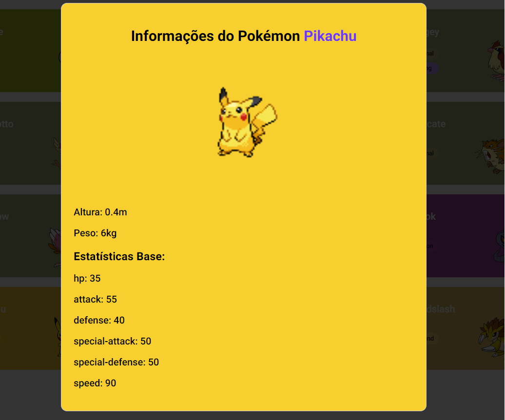

# Creating a Pokedex by consuming an API called pokeapi

## A fully functional EXAMPLE project written in JavaScript showing how to consume an API via fetch

This project is an example that was built along with an Bootcamp offered by digital innovation one (DIO) showing how to create a Pokedex by consuming pokeApi by fetch API. Every part of this project is sample code which shows how to do the following:

    * create an HTTP request via fetch API
    * consume the HTTP request with JavaScript functions
    * Create a modal to provide information about the selected pokemon

           

## How to tweak this project for your own uses
Since this is an example project, I´d encourage you to clone and rename this project to use for your own purposes.

## 📖 Useful links
- [Bootcamp offered by DIO] (https://web.dio.me/track/7a55c727-bb2a-42a7-831b-6c38b4e83868)

- [Pokeapi] (https://pokeapi.co/)

## Find a bug?
If you found an issue or would like to submit an improvement to this project, please submit an issue using the issue tab above. If you would like to submit a PR with a fix, reference the issue you created! 

## Known issues (work in progress)
This pokedex is till ongoing. There are lots of information and customization about the pokemon that have not been completed yes. This is coming soon!
